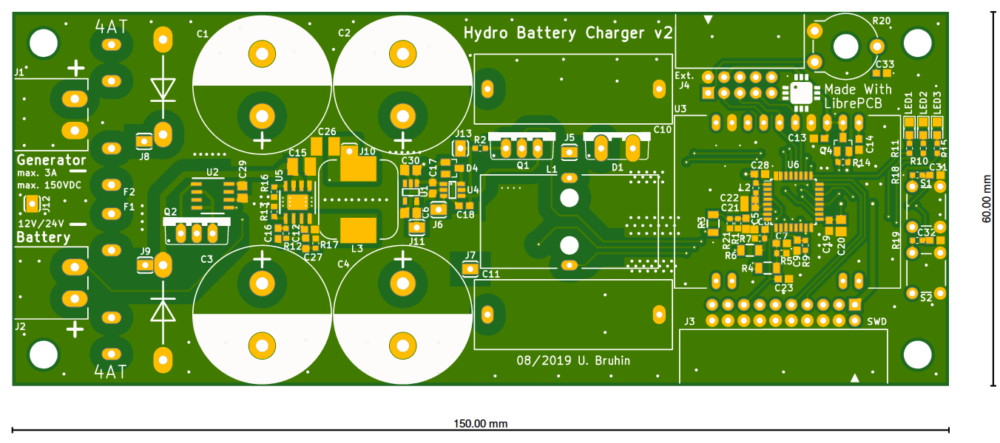

# Hydro Battery Charger

## Description

This is a [LibrePCB](https://librepcb.org) project for a hydro power battery
charger PCB, controlled by a STM32L0 microcontroller.

## License

See [LICENSE.txt](LICENSE.txt).
